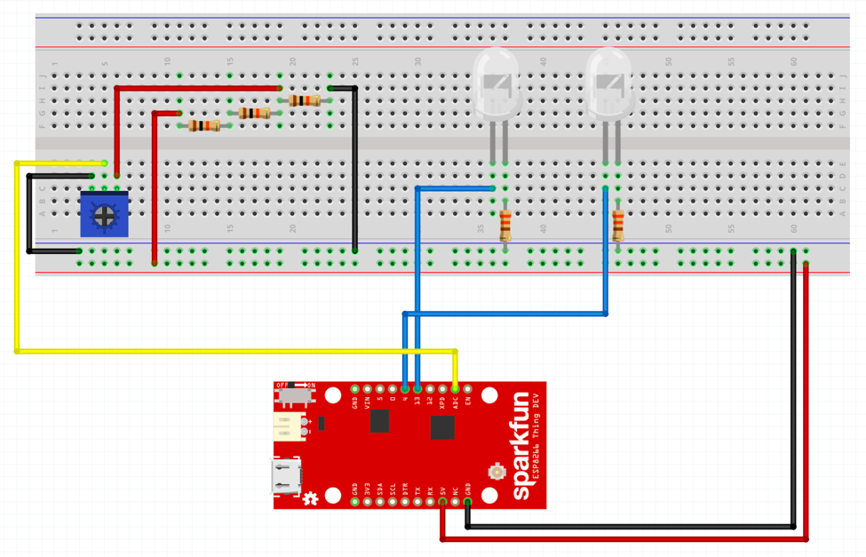

# Circuit
This circuit sample will read the position of the dial and light the high or low warning lamps when it is turned to the extremes.

The following layout will support the (dial_input.ino)[dial_input/dial_input.ino] code.

* Note that the long stem of the LED is positive.
* Note that 10K ohm resistors are used for the Trimpot.
* Note that 330 ohm resistors are used for the LEDs.

